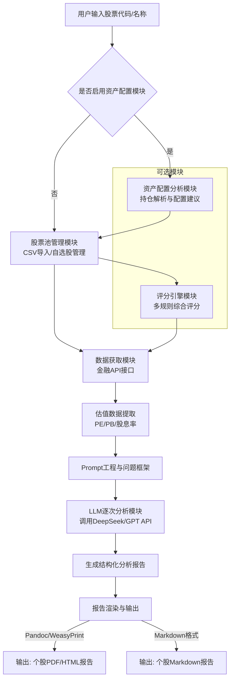

AI股票深度分析系统需求说明书
文档版本：V2.0
创建时间：2026-01-30
文档目标：为AI编程输入提供清晰、结构化的技术需求说明，确保系统构建的模块化、可执行与最终交付的一致性。

一、项目概述
1.1 项目目标设计并实现一个基于用户指定股票的AI深度分析系统，通过金融API获取估值数据，利用大语言模型进行结构化分析，生成专业投资研究报告。
1.2 核心价值
提升分析效率：自动化完成从数据获取到报告生成的全流程，大幅缩短研究时间。
深度专业分析：利用LLM对估值数据进行多维度、结构化的深度分析，提供专业投资视角。
标准化输出：生成格式统一的Markdown/PDF研究报告，便于归档、对比与分享。
精准控制：用户直接指定分析目标，避免不必要的API调用，实现成本可控。

二、系统架构与功能模块
系统采用多模块可选架构，具体流程如下：


2.1 核心分析模块 (AI Analyst)
输入：用户指定的股票代码或名称（支持A股、港股等市场）。
处理：
数据获取：通过金融API接口（如AKShare、Tushare Pro）获取指定股票的实时估值数据，包括市盈率（PE）、市净率（PB）、股息率等关键指标。
Prompt工程：基于预设的分析框架，将估值数据组织成结构化的问题序列，引导LLM进行深度分析。
逐次分析：LLM按照预设的问题框架，逐次回答关于估值合理性、行业对比、投资价值等专业问题。
报告生成：将LLM的分析结果整理成结构化的研究报告，包含摘要、估值分析、投资建议等标准章节。
报告渲染：将Markdown报告转换为更便于分发和审阅的PDF或HTML格式。
输出：
针对用户指定股票的独立PDF/HTML分析报告。
Markdown格式的原始分析报告。
注意事项：采用逐次问答模式确保分析深度，避免一次性生成导致的浅层分析问题。

2.2 股票池管理模块 (Stock Pool Manager)
输入：用户手动筛选的股票池（CSV格式）或自选股列表。
处理：
- CSV导入：支持标准CSV格式股票数据导入，自动识别股票代码、名称等关键字段
- 自选股管理：通过YAML配置文件管理用户自选股列表
- 数据合并：自动合并量化筛选结果和用户自选股，处理重复股票
- 股票池维护：提供统一的股票池管理接口，支持数据缓存和更新
输出：
- 统一股票池（Markdown格式）
- 量化筛选结果缓存（JSON格式）
- 自选股配置文件（YAML格式）

2.3 资产配置模块 (Asset Allocation Module)
输入：用户持仓截图（可选）或当前股票池信息。
处理：
- OCR解析：通过OCR技术解析持仓截图，提取股票持仓信息
- 配置分析：分析当前持仓的大类资产配置情况
- 专业建议：基于资产配置理论给出优化建议（60/40、风险平价等策略）
- 模块独立性：完全独立模块，可选择是否启用，不影响主流程
输出：
- 文本格式的资产配置建议
- 当前持仓分析报告

2.4 评分引擎模块 (Scoring Engine)
输入：股票池中的股票数据。
处理：
- 多规则评分：支持多套评分规则配置，每套规则包含权重和阈值
- 自定义策略：用户可配置不同的评分策略（价值投资、成长投资等）
- 综合排序：根据评分结果对股票进行综合排序
输出：
- 评分结果和排序列表
- 评分规则配置（YAML格式）

三、技术选型建议
模块推荐技术栈说明
开发语言Python 3.8+生态丰富，在数据科学、自动化脚本领域有强大优势。
数据获取AKShare / Tushare Pro提供A股/港股基本面数据API，支持获取PE、PB、股息率等估值数据。
AI调用OpenAI GPT API / DeepSeek API / 其他兼容接口根据成本、模型能力和上下文长度选择。需封装API调用与错误处理。
报告渲染 (MD -> PDF)Pandoc + LaTeX / WeasyPrint / PyPDF2Pandoc支持丰富格式转换；WeasyPrint适合HTML/CSS渲染；需评估部署复杂度。
配置管理 config.yaml  /  .env  文件用于管理API密钥、分析框架模板、文件路径等可变参数，实现代码与配置分离。


四、实现步骤与核心代码示例

4.1 核心分析流程 (伪代码逻辑)
# 功能：单只股票AI分析流程
1. 输入：用户指定的股票代码或名称。
2. 调用金融API接口，获取该股票的估值数据（市盈率PE、市净率PB、股息率等）。
3. 数据清洗与格式化：提取关键估值指标，封装为结构化数据格式。
4. Prompt构建与逐次分析：
   - 构建分析框架，包含多个专业问题（如："当前PE水平是否合理？"、"与行业平均相比如何？"、"股息率是否具有吸引力？"）
   - 逐次调用LLM API，针对每个问题进行分析回答
5. 结果整合：将LLM的分析回答整理成结构化的研究报告。
6. 报告生成：保存为Markdown格式，并转换为PDF。

4.2 主程序脚本示例 ( main_analyzer.py )
```python
import argparse
from analyst import analyze_stock  # 核心分析模块

CONFIG = {
"report_output_dir": "./reports/",
"analysis_framework": {
    "valuation_analysis": "请分析当前PE/PB估值水平是否合理",
    "industry_comparison": "与同行业公司相比估值如何",
    "dividend_attractiveness": "股息率是否具有投资吸引力",
    "investment_risk": "当前估值下存在哪些主要风险",
    "investment_recommendation": "给出投资建议和理由"
}
}

def main():
"""主分析程序 - 用户指定股票分析模式"""
# 用户输入股票代码
parser = argparse.ArgumentParser(description='AI股票分析系统')
parser.add_argument('stock_code', type=str, 
                   help='要分析的股票代码（例如：000001 或 600519）')
args = parser.parse_args()

# 执行单只股票分析
report_info = analyze_stock(args.stock_code, CONFIG["analysis_framework"], CONFIG["report_output_dir"])

if report_info:
print(f"分析完成！报告已保存至：{report_info['report_path']}")
else:
print("分析失败，请检查股票代码是否正确或网络连接是否正常。")

if __name__ == "__main__":
main()
```

4.3 分析框架配置文件 (analysis_framework.yaml)
```yaml
# 预设的分析问题框架 - 可编辑的配置文件
analysis_framework:
  - question: "公司基本情况概述"
    prompt: "请简要介绍该公司的基本情况，包括主营业务、行业地位等基本信息。"
    
  - question: "估值水平分析"
    prompt: "基于以下估值数据（PE：{pe}，PB：{pb}，股息率：{dividend_yield}），请分析该股票当前估值水平是否合理，并说明理由。"
    
  - question: "行业对比评估"
    prompt: "将该股票的估值数据与同行业平均水平进行对比，分析其在行业中的相对估值位置和竞争优势。"
    
  - question: "投资价值分析"
    prompt: "从估值角度评估该股票的投资价值，包括潜在收益空间和主要风险因素。"
    
  - question: "综合投资建议"
    prompt: "基于以上分析，给出具体的投资建议（买入/持有/卖出）并说明理由，同时提供风险提示。"

# 报告模板配置
report_template:
  title: "{stock_name}({stock_code})投资分析报告"
  disclaimer: "本报告由AI生成，仅供研究参考，不构成投资建议。投资有风险，决策需谨慎。"
  sections:
    - "摘要"
    - "公司概况"
    - "估值分析"
    - "投资价值评估"
    - "投资建议"
```

4.4 配置文件加载示例
```python
import yaml

def load_analysis_framework(config_path="analysis_framework.yaml"):
    """加载分析框架配置文件"""
    try:
        with open(config_path, 'r', encoding='utf-8') as file:
            config = yaml.safe_load(file)
        return config
    except FileNotFoundError:
        print(f"配置文件 {config_path} 不存在，使用默认框架")
        return get_default_framework()

def get_default_framework():
    """默认分析框架（备份）"""
    return {
        "analysis_framework": [
            {
                "question": "估值分析",
                "prompt": "分析股票{stock_code}的估值合理性，基于PE={pe}, PB={pb}, 股息率={dividend_yield}"
            },
            {
                "question": "投资建议", 
                "prompt": "给出投资建议并说明理由"
            }
        ]
    }
```

模式说明：分析框架独立存储在配置文件中，便于后续修改和扩展。系统会自动检测配置文件是否存在，如不存在则使用默认框架。

五、关键注意事项与约束条件
数据质量：免费数据源（如AKShare）的稳定性与完整性是项目风险点，需设计重试与容错机制，并对关键数据做有效性校验。
API成本与限流：大模型API调用按Token计费，批量处理前必须估算成本。代码中须实现速率控制（如 time.sleep ）及月度用量监控，避免意外开销。
Prompt工程质量：分析报告的深度与实用性高度依赖Prompt模板的设计。这是一个需要持续迭代优化的核心环节。
法律与合规：生成的分析报告内容需符合相关金融信息服务规定，禁止做出具体投资建议或收益承诺。系统应在输出报告显著位置加入"本报告由AI生成，仅供研究参考，不构成投资建议"等免责声明。
系统定位：本系统设计为辅助研究工具，所有AI生成的结论必须经过专业研究人员的最终审核与判断，不可直接用于投资决策。

六、后续迭代方向
### 已实现功能
- **灵活股票池管理**：支持CSV导入和自选股管理，替代原有的API量化筛选
- **资产配置建议**：独立的大类资产配置分析模块，支持OCR持仓解析
- **智能评分引擎**：多规则配置的股票综合评分系统

### 未来扩展方向
数据源扩展：集成更多市场（如美股）、更多数据类型（如研报、新闻情感分析）。
分析维度深化：在Prompt模板中引入杜邦分析、现金流折现模型（DCF）等更复杂的分析框架。
自动化触发：结合任务调度系统（如Apache Airflow），实现定期（如每周）自动运行流水线。
交互界面：开发简单的Web界面或命令行工具，便于非技术用户配置筛选条件和查看报告。

### 架构优化
- 模块化设计：保持各功能模块的独立性，支持按需启用
- 配置化管理：通过YAML配置文件实现灵活的参数调整
- 用户控制：优先用户手动筛选，AI提供分析辅助而非自动决策

文档结束
